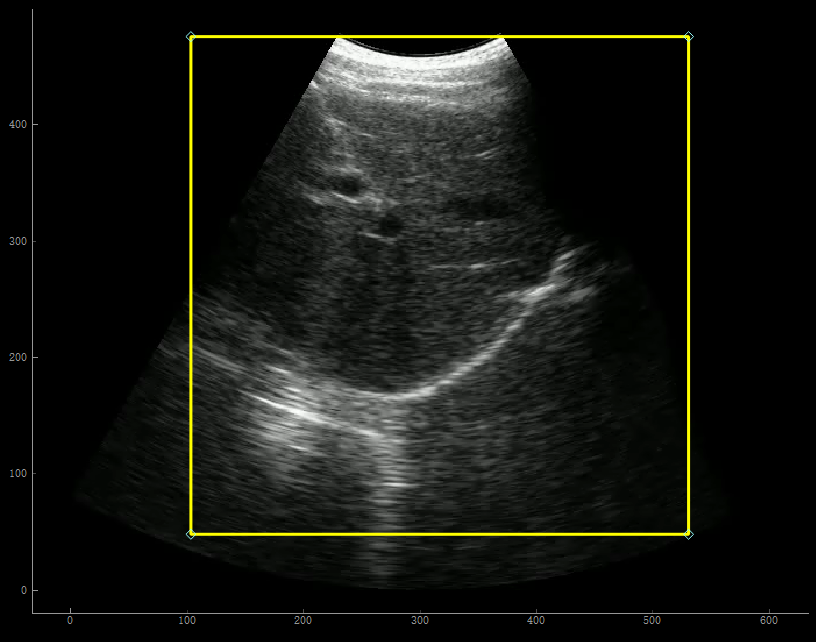

# RespiraLab

## A tool for Analyzing Ultrasound Images of Diaphragm

Zhen Song, Yu Sun, Vaheh Nazari, Yihao Zhou, Yongping Zheng

(Department of Biomedical Engineering, The Hong Kong Polytechnic University)

Below are the official implementation of RespiraLab, which ***will be fully open-sourced after the relevant paper is published***.

## Table of contents

* [Real-time demo](#demo)
* [Overview](#overview)
* [Getting started](#getting-started)
* [Use the GUI](#use-the-gui)
* [Data format](#data-format)
* [Methodology](#methodology)

## Demo

Based on video segmentation and machine learning methods, **RespiraLab** is an Interactive tool focused on diaphragm monitoring and cough strength estimation using B-mode ultrasound. It can be used for other potential applications in ICU, such as weaning outcome predection. Below are three **real-time** demos using our multi-view probes:

- Diaphragm **monitoring** during resipration:

https://github.com/user-attachments/assets/aa7f50d7-b524-4b7f-a2a6-90eee592ed16

- **Cough strength estimation** (Mild cough):

https://github.com/user-attachments/assets/c0818520-b2ce-4249-b248-f44aac0ff1ce


- **Cough strength estimation** (Heavy cough):

https://github.com/user-attachments/assets/aab362b4-5bbe-48d5-b1a7-dedf36f09f77


More results of **offline processing** can be found in [demo0](demo0) and [demo1](demo1)

## Overview

<div align=center></div>

**RespiraLab** is built on high-performance video segmentation algorithms and enables users to automatically analyze custom data:

* Users can [load their own video data](#getting-started).
* Software produce data in a easy-to-manage [directory and format](#data-format).
* Generate ROIs and initial masks [automatically](#methodology) or manually.
* [Real-tmie visulize](#demo) segmented videos, SMG signals, SMG features, and estimated Cough Peak Flow.
* [Multi-view ultrasound analysis](#methodology).

## Getting started

* Prepare the videos to be processed with the names 'xx.mp4' (for intercostal view) and 'xx_.mp4' (for subcostal view), and place them in the same path. "mp4" and "avi" formats are supported. (Examples: [demo0.mp4](demo0/demo0.mp4), and [demo0_.mp4](demo0/demo0_.mp4))
* Double click RespiraLab.exe to open GUI.
* Select one of the videos to load, and the software will automatically read the existing ROIs, initial masks, and data, displaying them in the GUI.
* Follow the [instructions](#use-the-gui) to set up, start processing, and export the data.

### Environment configuration for GPU inference

* Avaliable after the relevant paper is published.

## Use the GUI

1. To ensure the GPU inference otherwise default to CPU inference:

```Bash
Conda activate env_name
RespiraLab.exe
```

2. Load videos and other pre-settings by pressing:


3. Set Regions of interest (ROIs) by dragging the handle of scalable boxes or [automatically generating](#methodology):

<div style="display: flex; justify-content: left;">
    
    
</div>

4. [Generate](#methodology) or draw inital masks:

<div style="display: flex; justify-content: left;">
    
    
</div>
Using Polyline to draw masks in manual mode.

5. Check the readiness of processing:
The green color of the toolbar icons indicates whether the different preset configurations are ready.

6. Calibrate the unit and start processing by pressing:


7. Show results:
<div style="display: flex; justify-content: left;">
    
    
</div>
SMG signals and extracted SMG features.

8. Illustrate cough peak flow if in cough mode.

9. [Export data](#data-format) automaticallg in .xls fomat.

## Data format

- Videos are expected to use .avi or .mp4 format.
- Prepared and resulted files are preferred to organize as follows (Taken [demo0](demo0) as an example name):

```bash

demo0
├── images                // file containing processed images
│   ├── demo0_0.jpg
│   ├── demo0_0_.jpg
│   └── ...
├── masks                 // file containing generated masks
│   ├── demo0_0.png
│   ├── demo0_0_.png
│   └── ...
├── demo0.mp4             // videos of intercostal view
├── demo0.png             // initial mask of subcostal view
├── demo0_.mp4            // videos of subcostal view
├── demo0_.png            // initial mask of intercostal view
├── demo0_roi.txt         // saved roi information
└── demo0.xls             // exported data

```
(Two examples: [demo0](demo0) and [demo1](demo1))

## Methodology

Avaliable after the relevant paper is published

## Citing

Not applicable

## Contact

<zhen0212.song@connect.polyu.hk> <yongping.zheng@polyu.edu.hk>
